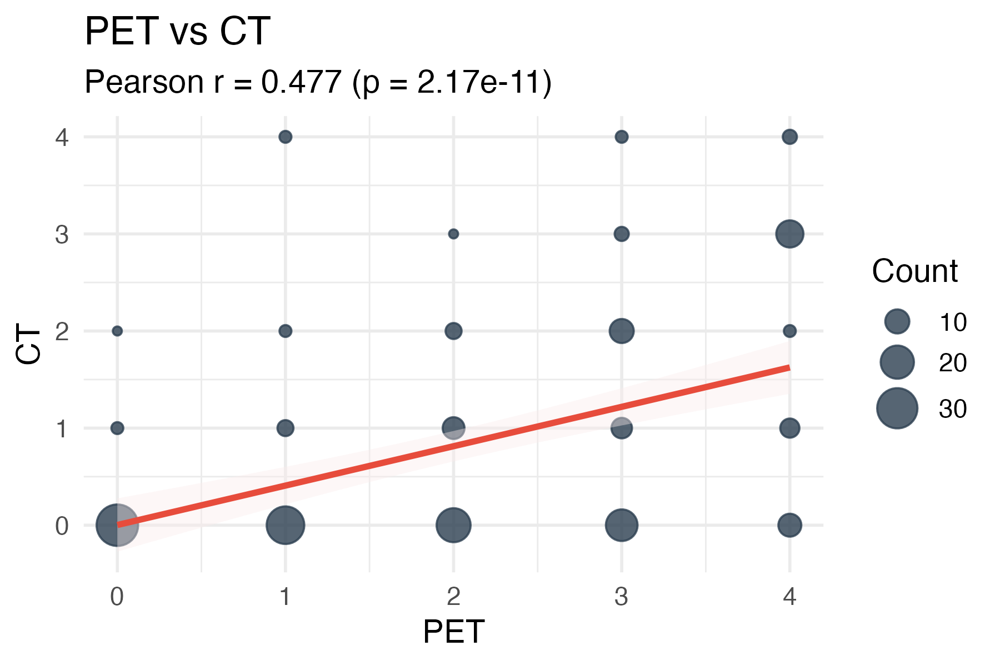
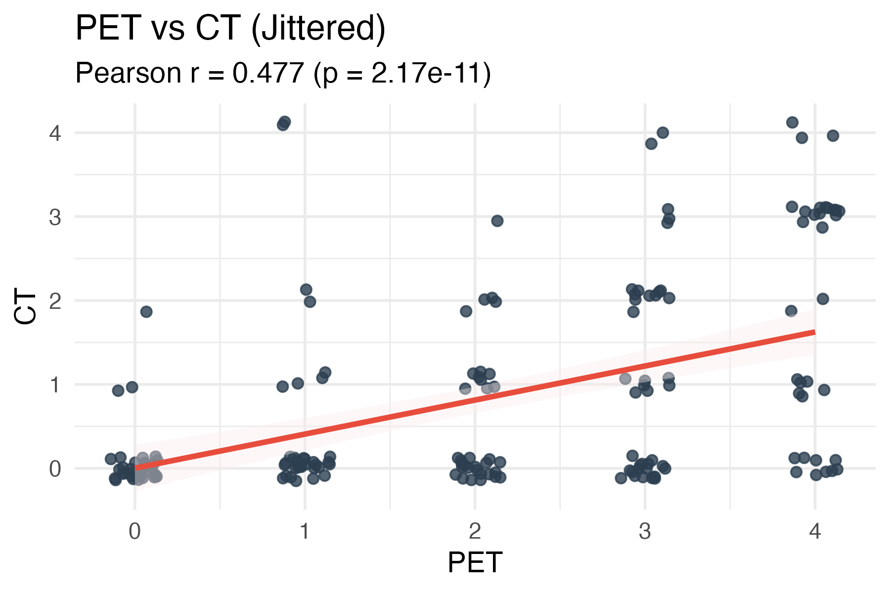
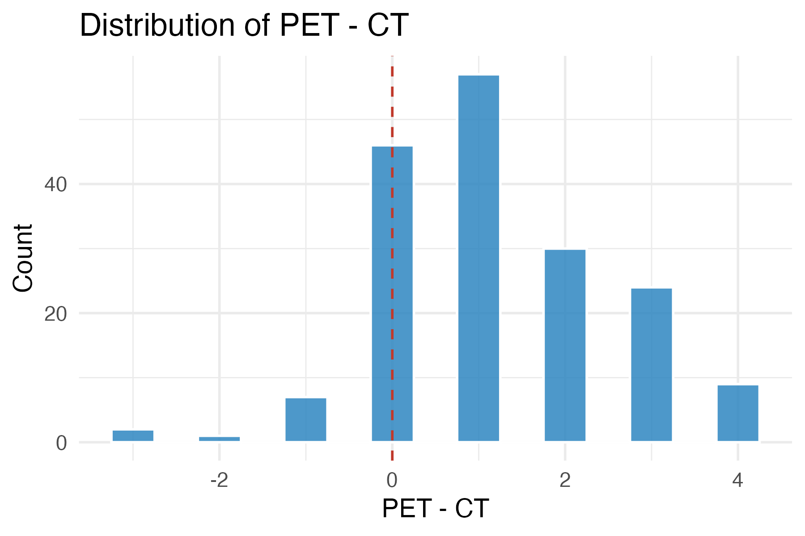
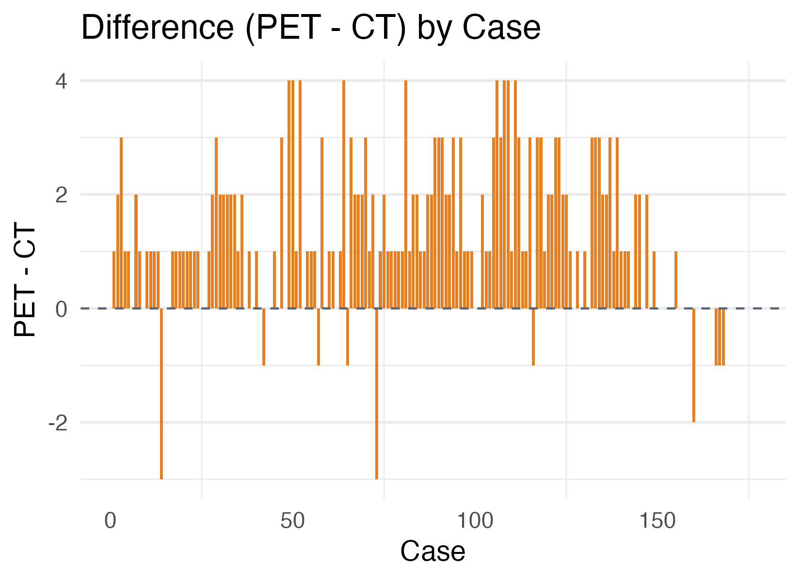
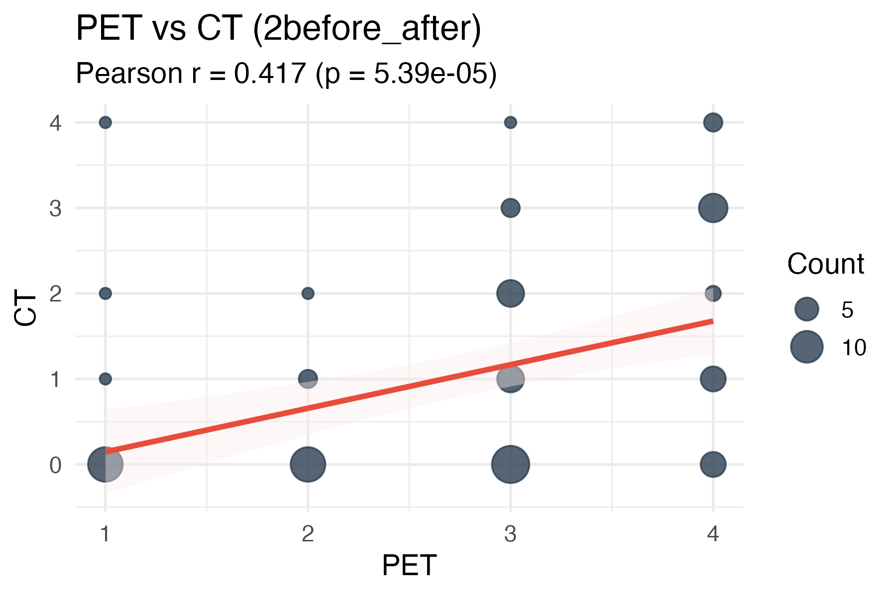
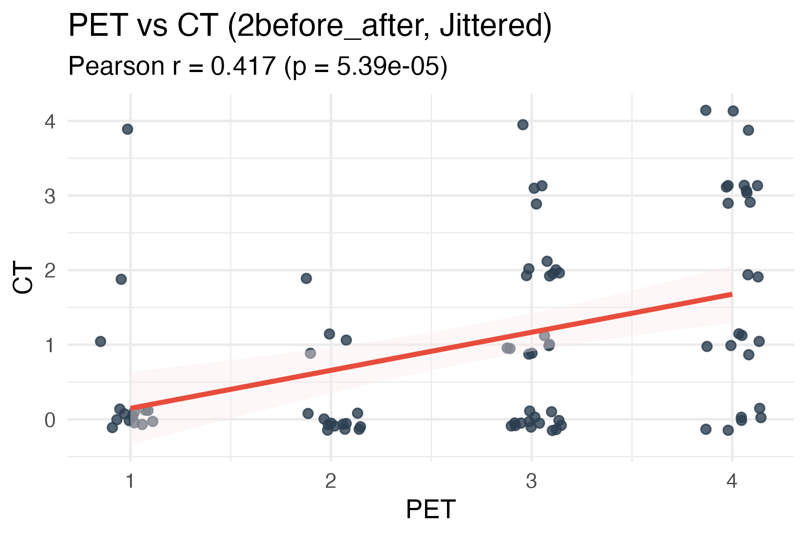
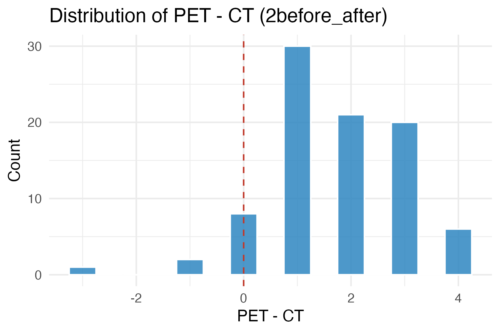
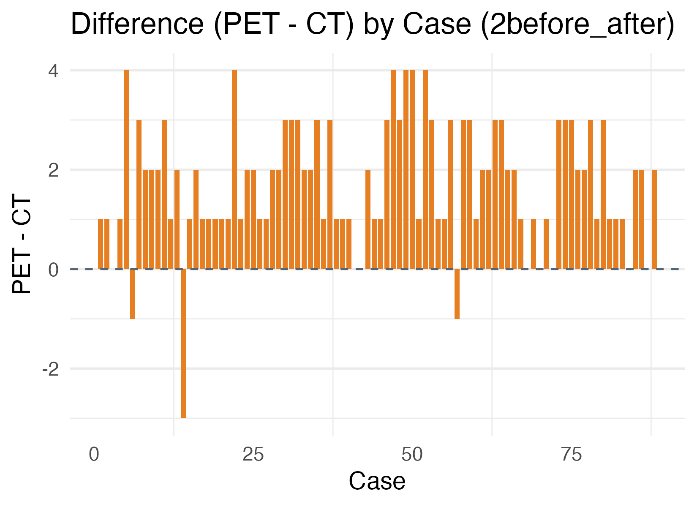

# 1all / 2before_after 解析サマリー

## 指標サマリー
| データセット | n | Pearson r | r の p値 | Sign test p値 | Wilcoxon p値 |
| --- | --- | --- | --- | --- | --- |
| 1all データ | 176 | 0.477 | 2.17e-11 | 2.13e-25 | 5.3e-19 |
| 2before_after データ | 88 | 0.417 | 5.39e-05 | 7.06e-20 | 7.12e-14 |

## 1all データ

- サンプル数: 176
- Pearson 相関係数: 0.477 (p = 2.17e-11)
- 回帰式: CT = 0.002 + 0.406 * PET (調整済R² = 0.223)
- 符号検定 (PET > CT) p値: 2.13e-25
- Wilcoxon 符号付順位検定 (PET > CT) p値: 5.3e-19

### 図

## 2before_after データ

- サンプル数: 88
- Pearson 相関係数: 0.417 (p = 5.39e-05)
- 回帰式: CT = -0.363 + 0.510 * PET (調整済R² = 0.164)
- 符号検定 (PET > CT) p値: 7.06e-20
- Wilcoxon 符号付順位検定 (PET > CT) p値: 7.12e-14

### 図

